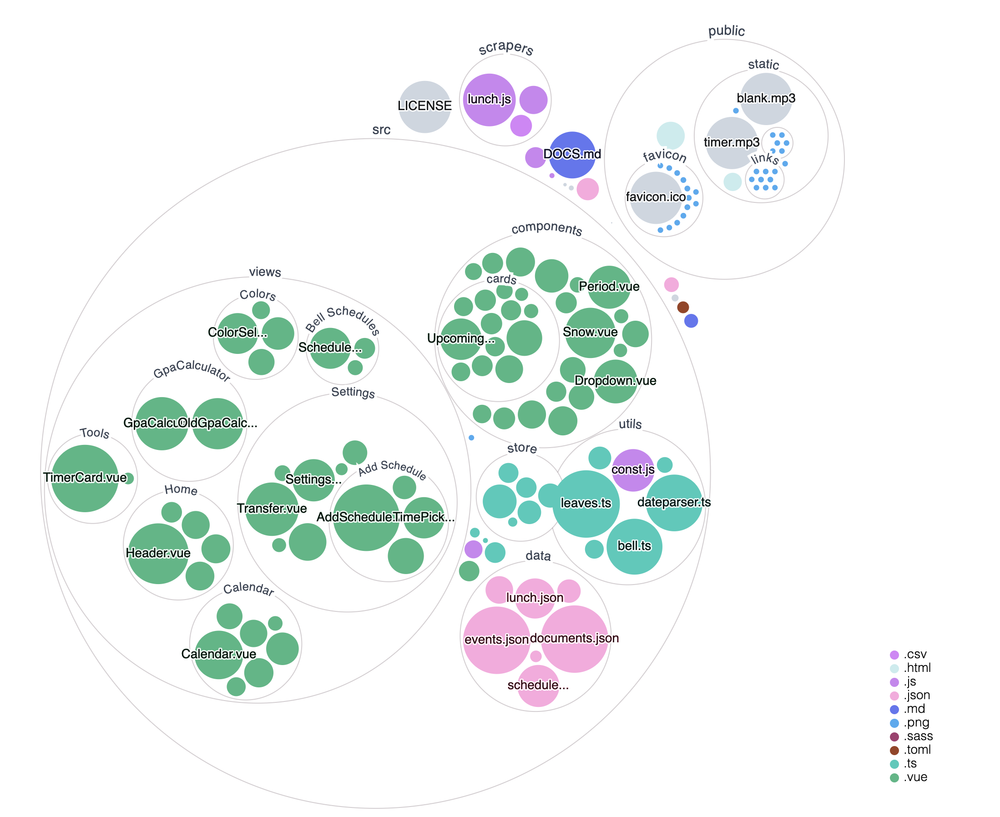

# Student contributors needed to maintain Stevenson.Space

Stevenson.Space was created in 2016 and has been a student-run project ever since. The site doesn't run itself and requires constant maintenance, bug fixes and upgrades only made possible by its contributors. Unknown to many, the code for the website is open-sourced (publically available) and the opportunity to contribute to the website is extended to the entire Stevenson community. We are currently looking for new contributors. 

The Spring Semester of 2022 will provide crucial experience to underclassmen who are interested in consistently contributing to all the major functions of the site into the future. This work includes updating lunch menus, schedules, themes, holiday messages, and fixing bugs that arise in our systems. Being a consistent contributor is a significant time commitment, even for relatively experienced developers. 

Those who are not up to the commitment of being a committed contributor, are still able to contribute to the site with no bureaucratic barriers to entry through Github. 

## Technical Overview
Stevenson.Space uses the following languages/technologies

- Github
- Vue.js + VueX, SASS, ESlint
- Node.js
- Typescript
- Node Package Manager (NPM)
- Netlify CI/CD builds
- Google OAth 2.0

*Note: If you know Javascript, HTML, and CSS well, you will be close to being able to work with Vue. Also React, Nuxt, Gatsby, and other JS frameworks are quite similar to Vue.js. Node.js and Typescript are forms of Javascript.*

## I'm interested, what next?

We have created an interest form found here. Please fill out the form if you are interested.

### Check out the [Wiki Documentation](https://github.com/stevenson-space/shs/wiki)

&nbsp;

## Also, check out the neat [Interactive Code Map](https://octo-repo-visualization.vercel.app/?repo=stevenson-space%2Fshs) to get an idea of the project's structure.
